# 📦 Deployment Plan - EvalTrack

## 1. Objetivo y Alcance

**Propósito:**  
Despliegue y puesta en marcha de EvalTrack, sistema de gestión de talento humano v2.0, que permite la administración integral de empleados, eventos, asistencias y evaluaciones corporativas.

**Ámbito:**  
- Backend Laravel 12 (API y lógica de negocio)
- Frontend Blade (vistas para usuario, gestor y administrador)
- Bases de datos:
  - PostgreSQL (usuarios, roles, permisos, sesiones, cache)
  - MySQL (empleados, eventos, asistencias, evaluaciones)
- Configuración de variables de entorno y seeders

**Dependencias:**  
- Servicios de correo (Mailpit/local)
- XAMPP (entorno local)
- Composer/NPM

---

## 2. Arquitectura

```
┌─────────────────┐    ┌────────────────────┐    ┌────────────────────┐
│   Load Balancer │───▶│  Web Servers       │───▶│  PostgreSQL DB     │
│   (Nginx)       │    │  (Laravel + PHP)   │    │  (Users/Roles)     │
└─────────────────┘    └────────────────────┘    └────────────────────┘
                              │
                              ▼
                       ┌────────────────────┐    ┌────────────────────┐
                       │  MySQL Database    │    │  Redis Cache       │
                       │  (Business Data)   │    │  (Sessions/Cache)  │
                       └────────────────────┘    └────────────────────┘
```

- **Laravel App** conecta a dos bases de datos:
  - **PostgreSQL:** usuarios, roles, permisos, sesiones, cache.
  - **MySQL:** empleados, eventos, asistencias, evaluaciones.
- **Mailpit/SMTP** para pruebas de correo.
- **Redis** opcional para cache/sesiones en producción.

---

## 3. Versiones y Artefactos

**Código/Artefacto:**  
- Repositorio: [github.com/DarwinValdiviezo/evaltrack](https://github.com/DarwinValdiviezo/evaltrack.git)
- Rama principal: `main`
- Último commit/tag: consultar en el repositorio
- Artefactos: Aplicación Laravel, scripts de migración y seeders

**Configuraciones:**  
- Variables de entorno críticas: `.env` (ver ejemplo en el repositorio)
- Secrets: Claves de base de datos y mail gestionadas localmente

---

## 4. Entornos y Pipeline CI/CD

**Flujo de despliegue:**  
- Etapas:
  - Desarrollo (local con XAMPP)
  - QA (opcional, manual)
  - Producción (manual, futura automatización)
- Pipeline:
  - *No implementado aún* (planeado para GitHub Actions)
- Estrategia de despliegue:
  - Manual en local
  - Rolling Update (planeado para K8s en el futuro)
  - Ventana de mantenimiento: fuera de horario laboral

---

## 5. Comandos Clave para Despliegue Local

```bash
# Migraciones y seeders
php artisan migrate --database=pgsql --path=database/migrations/users
php artisan migrate --database=mysql_business --path=database/migrations/business
php artisan db:seed --class=UserEmpleadoSyncSeeder --database=mysql
php artisan db:seed --class=EventoSeeder --database=mysql

# Servidor local
php artisan serve
```

---

## 6. Contacto y Soporte

- Repositorio: [github.com/DarwinValdiviezo/evaltrack](https://github.com/DarwinValdiviezo/evaltrack.git)
- Email: soporte@evaltrack.com 

---

## 7. Plan de Despliegue a Producción

### 7.1 Precondiciones

| Requisito                                   | Responsable     | Estado |
|---------------------------------------------|-----------------|--------|
| Código revisado y probado en local          | Desarrollador   |        |
| Artefactos generados y validados            | Desarrollador   |        |
| Variables de entorno y secretos configurados| DevOps          |        |
| Backups recientes de BD y archivos críticos | DevOps          |        |
| Accesos y permisos revisados                | DevOps          |        |
| Plan de rollback documentado y probado      | DevOps          |        |
| Notificación previa a stakeholders/usuarios | DevOps/Líder    |        |

---

### 7.2 Estrategia de Despliegue

- **Tipo:** Rolling Update (planeado para K8s), actualmente manual
- **Ventana de mantenimiento:** Fuera de horario laboral
- **Rollback:** Scripts preparados y validados
- **Monitoreo:** Logs en tiempo real y alertas configuradas

---

### 7.3 Actividades Paso a Paso

| Paso | Actividad                                                                 | Responsable     | Detalle/Comando clave                                  |
|------|--------------------------------------------------------------------------|-----------------|--------------------------------------------------------|
| 1    | Código listo, pruebas locales exitosas                                   | Desarrollador   |                                                        |
| 2    | Push/Merge a rama principal                                              | Desarrollador   |                                                        |
| 3    | Notificar a DevOps y QA                                                  | Desarrollador   |                                                        |
| 4    | Definir estrategia de despliegue                                         | DevOps          | Blue/Green, Rolling, Downtime, etc.                    |
| 5    | Verificar requisitos de infraestructura                                  | DevOps          | Servidores, red, almacenamiento                        |
| 6    | Revisar versiones de dependencias                                        | DevOps          | PHP, Node, Docker, Nginx, etc.                         |
| 7    | Preparar scripts de instalación y rollback                               | DevOps          |                                                        |
| 8    | Configurar variables de entorno y secretos                               | DevOps          | .env, claves, tokens                                   |
| 9    | Realizar backup de bases de datos y archivos críticos                    | DevOps          |                                                        |
| 10   | Notificar a stakeholders y usuarios                                      | DevOps/Líder    |                                                        |
| 11   | Checklist de preproducción                                               | QA              |                                                        |
| 12   | Aprobar despliegue a producción                                          | QA              |                                                        |
| 13   | Instalar dependencias (Composer, NPM, Docker)                            | DevOps          | composer install, npm install, docker pull             |
| 14   | Configurar servicios (Nginx, PHP-FPM, Redis, etc.)                       | DevOps          |                                                        |
| 15   | Configurar monitoreo y alertas                                           | DevOps          |                                                        |
| 16   | Verificar endpoints de servicios externos                                | DevOps          |                                                        |
| 17   | Poner aplicación en modo mantenimiento                                   | DevOps          | php artisan down                                       |
| 18   | Ejecutar pipeline de despliegue                                          | DevOps          |                                                        |
| 19   | Desplegar artefactos (código, Docker, assets)                            | DevOps          |                                                        |
| 20   | Aplicar migraciones de base de datos                                     | DevOps          | php artisan migrate                                    |
| 21   | Actualizar variables/configuración                                       | DevOps          |                                                        |
| 22   | Reiniciar servicios                                                      | DevOps          | systemctl restart nginx, php-fpm, etc.                 |
| 23   | Verificar logs y monitoreo en tiempo real                                | DevOps          | tail -f storage/logs/laravel.log                       |
| 24   | Realizar pruebas de humo (smoke tests)                                   | QA/DevOps       |                                                        |
| 25   | Salir de modo mantenimiento                                              | DevOps          | php artisan up                                         |
| 26   | Notificar a soporte y stakeholders                                       | DevOps          |                                                        |
| 27   | Usuario recibe notificación de nueva versión (opcional)                  | DevOps/Comunic. |                                                        |
| 28   | Usuario accede a la aplicación actualizada                               | Usuario Final   |                                                        |
| 29   | Usuario usa nuevas funcionalidades                                       | Usuario Final   |                                                        |
| 30   | Usuario reporta incidencias o feedback                                   | Usuario Final   |                                                        |
| 31   | Soporte monitorea incidencias y feedback                                 | Soporte         |                                                        |
| 32   | ¿Incidencias críticas?                                                   | Soporte         |                                                        |
| 33   | Si SÍ: Activar plan de rollback                                          | Soporte/DevOps  |                                                        |
| 34   | Si NO: Continuar monitoreo                                               | Soporte         |                                                        |

---

### 7.4 Postcondiciones

| Resultado esperado                                      | Responsable     |
|--------------------------------------------------------|-----------------|
| Aplicación disponible y funcional en producción         | DevOps          |
| Usuarios acceden y usan nuevas funcionalidades         | Usuario Final   |
| Monitoreo y alertas activos                            | DevOps/Soporte  |
| Backups recientes y plan de rollback listo             | DevOps          |
| Soporte informado y preparado para incidencias         | Soporte         |

---

### 7.5 Diagrama del Plan de Despliegue

```mermaid
flowchart TD
    DEV1["Desarrollador: Código listo, pruebas locales exitosas"]
    DEV2["Push/Merge a rama principal"]
    DEV3["Notificar a DevOps y QA"]
    PRE1["Definir estrategia de despliegue (Blue/Green, Rolling, Downtime, etc.)"]
    PRE2["Verificar requisitos de infraestructura (servidores, red, almacenamiento)"]
    PRE3["Revisar versiones de dependencias (PHP, Node, Docker, Nginx, etc.)"]
    PRE4["Preparar scripts de instalación y rollback"]
    PRE5["Configurar variables de entorno y secretos"]
    PRE6["Realizar backup de bases de datos y archivos críticos"]
    PRE7["Notificar a stakeholders y usuarios"]
    QA1["Checklist de preproducción"]
    QA2["Aprobar despliegue a producción"]
    INST1["Instalar dependencias (Composer, NPM, Docker)"]
    INST2["Configurar servicios (Nginx, PHP-FPM, Redis, etc.)"]
    INST3["Configurar monitoreo y alertas"]
    INST4["Verificar endpoints de servicios externos"]
    D1["Poner aplicación en modo mantenimiento"]
    D2["Ejecutar pipeline de despliegue"]
    D3["Desplegar artefactos (código, Docker, assets)"]
    D4["Aplicar migraciones de base de datos"]
    D5["Actualizar variables/configuración"]
    D6["Reiniciar servicios"]
    D7["Verificar logs y monitoreo en tiempo real"]
    D8["Realizar pruebas de humo (smoke tests)"]
    D9["Salir de modo mantenimiento"]
    D10["Notificar a soporte y stakeholders"]
    U1["Recibe notificación de nueva versión (opcional)"]
    U2["Acceder a la aplicación actualizada"]
    U3["Usar nuevas funcionalidades"]
    U4["Reportar incidencias o feedback"]
    S1["Monitorear incidencias y feedback de usuarios"]
    S2{"¿Incidencias críticas?"}
    S3["Activar plan de rollback"]
    S4["Continuar monitoreo"]
    DEV1 --> DEV2
    DEV2 --> DEV3
    DEV3 --> PRE1
    PRE1 --> PRE2
    PRE2 --> PRE3
    PRE3 --> PRE4
    PRE4 --> PRE5
    PRE5 --> PRE6
    PRE6 --> PRE7
    PRE7 --> QA1
    QA1 --> QA2
    QA2 --> INST1
    INST1 --> INST2
    INST2 --> INST3
    INST3 --> INST4
    INST4 --> D1
    D1 --> D2
    D2 --> D3
    D3 --> D4
    D4 --> D5
    D5 --> D6
    D6 --> D7
    D7 --> D8
    D8 --> D9
    D9 --> D10
    D10 --> U1
    U1 --> U2
    U2 --> U3
    U3 --> U4
    U4 --> S1
    S1 --> S2
    S2 -- "Sí" --> S3
    S2 -- "No" --> S4
    S3 --> S4
    S4 -.-> U2
```



--- 
